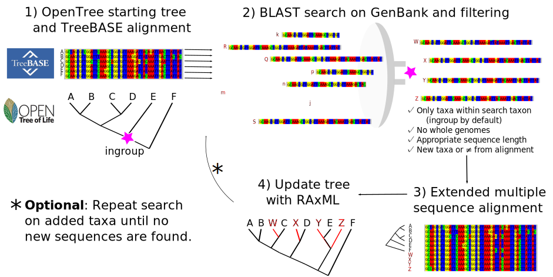
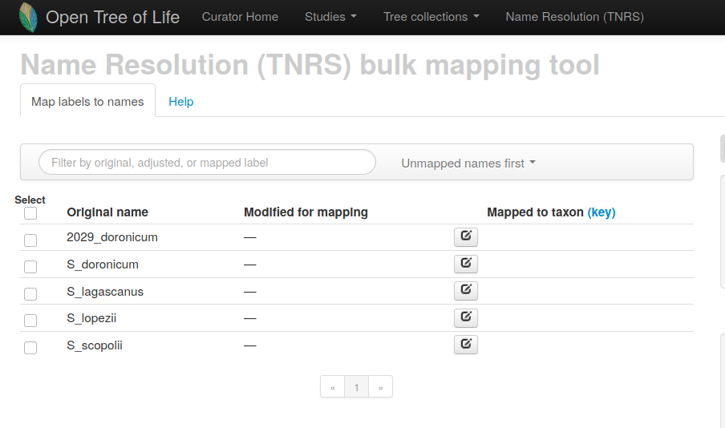
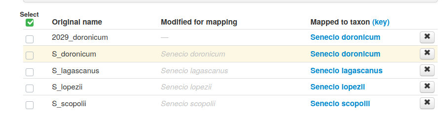

## The Physcraper framework

While genome scale data is increasing rapidly, there are still large quantities of gene-sequence data being uploaded to the US National Center on Biotechnology Information (NCBI) database [GenBank](https://www.ncbi.nlm.nih.gov/genbank/statistics/).
These data are often appropriate for looking at phylogenetic relationships, and have the advantage of being homologous to the sequences in existing trees.

If you have access to a single gene alignment, and a tree, Physcraper automates adding homologous data into your tree by using [Blast](https://blast.ncbi.nlm.nih.gov/Blast.cgi) to search for loci in GenBank that are likely to be homologous to sequences in an existing alignment.

 

Figure 1 from [Sanchez-Reyes et al. 2021](https://doi.org/10.1186/s12859-021-04274-6): The Physcraper framework consists of 4 general steps. The methodology is extensively described in the
[Implementation](https://physcraper.readthedocs.io/en/latest/methods_extended.html) section of the documentation.

 

By using a starting alignment and tree, Physcraper takes advantage of loci that previous researchers have assessed and deemed appropriate for the phylogenetic scope.
The sequences added in the search are limited either to a user specified taxon or monophyletic group, or within the taxonomic scope of the ingroup of the starting tree.

These automated trees can provide a quick inference or potential relationships, of problems in the taxonomic assignments of sequences, and flag areas of potential systematic interest.

 

## The Open Tree of Life

The Open Tree of Life ([OpenTree](https://tree.opentreeoflife.org/opentree/argus/opentree13.4@ott93302)) is a project that unites phylogenetic inferences and taxonomy to provide a synthetic estimate of species relationships across the entire tree of life.

 

OpenTree synthetic tree. Figure 1 from [Hinchliff et al. 2015](https://www.pnas.org/content/112/41/12764.short).
For more information on the OpenTree project see https://opentreeoflife.github.io

 

OpenTree aims to construct a comprehensive, dynamic and digitally-available tree of life by synthesizing published phylogenetic trees along with taxonomic data.
Currently the tree comprises 2.3 million tips.
However, only around 90,000 of those taxa are represented by phylogenetic estimates - the rest are placed in the tree based on their taxonomic names.

To achieve this, the OpenTree Taxonomy (OTT) constructs a reference taxonomy through an algorithmic combination of several source taxonomies, such as:
- [Hibbet et al. 2007](https://doi.org/10.1016/j.mycres.2007.03.004),
- [SILVA](http://www.arb-silva.de/),
- the [Index Fungorum](http://www.indexfungorum.org/),
- [Schäferhoff et al. 2010](https://doi.org/10.1186/1471-2148-10-352),
- the [World Register of Marine Species](WoRMS; http://www.marinespecies.org/aphia.php)
- the [NCBI Taxonomy](https://www.ncbi.nlm.nih.gov/books/NBK21100/),
- the Global Biodiversity Information facility [(GBIF) backbone Taxonomy](https://www.gbif.org/), and
- the [Interim Register of Marine and Nonmarine Genera (IRMNG)](https://irmng.org/).

 

## Quick start with the Physcraper software

### Updating a tree from Open Tree of Life

The Open Tree of Life data store, [Phylesystem](https://academic.oup.com/bioinformatics/article/31/17/2794/183373), contains more than 4,500 phylogenetic trees from published studies.
The tips in these trees are mapped to a unified taxonomy, which makes these data searchable in a phylogenetically explicit way.
This is a great place to start of finding existing estimates of phylogenetic relationships,
and assessing regions of the tree of life which are lacking available phylogenetic estimates.
There is a lot of sequence data available that has never been incorporated into any phylogenetic estimates.

#### *Find a starting tree with your taxon of interest*

For this example we will use a tree that is already in the Open Tree of Life database. You can find more details about finding a tree to update at the [Start section](https://physcraper.readthedocs.io/en/latest/find_trees.html) of this documentation.

To find trees containing your taxon of interest (e.g. 'Malvaceae') on OpenTree use:

    $ find_trees.py --taxon_name "Malvaceae"

This prints a bunch of studies out to the screen. We will need an alignment to update (which OpenTree does not store), so let's just look at trees that have data stored in TreeBASE.

    $ find_trees.py --taxon_name "Malvaceae" --treebase

There are a bunch of options!

Lets update the Wilkie et al. 2006 (https://doi.org/10.1600/036364406775971714) study.
You can view the study on the OpenTree database at [Wilkie, 2006](https://tree.opentreeoflife.org/curator/study/view/pg_55)

While this study was focused on the family Sterculiacea,
phylogenetic inference have suggested that this taxon is not monophyletic, as you can see on its [OpenTree homepage]((https://tree.opentreeoflife.org/opentree/argus/ottol@996482))

Let's take a look at how recent molecular data affect our inferences of relationships, and if there is sequence data for taxa that don't have any phylogenetic information available in the tree.

#### *Run the auto-update*

The script `physcraper_run.py` wraps together linking the tree and alignment, blasting, aligning sequences, and inferring an updated tree.
Detailed explanation of the inputs needed can be found in the [Run section](https://physcraper.readthedocs.io/en/latest/physcraper_run.html) of this documentation.

The BLAST search part of updating trees takes a long time. For example, this analysis took around 12 hours!
We recommend running it on a cluster or other remote computing option.

    $ physcraper_run.py -s pg_55 -t tree5864 -tb -r -o pg_55

The `-r` flag repeats the search on new sequences until no additional sequences are found.
We have put example outputs from this command in `docs/examples/pg_55`, so that you can explore the outputs without waiting for the searches to complete.

### Updating your own tree and alignment

You can upload your own tree to OpenTree to update it, and that way it will be included in the OpenTree synthetic tree!
See [Submitting-phylogenies-to-Open-Tree-of-Life](https://github.com/OpenTreeOfLife/opentree/wiki/Submitting-phylogenies-to-Open-Tree-of-Life) for more info on this.

If you aren't ready to share your tree publicly, you can update it without posting it to OpenTree.

You need an alignment (single locus) and a tree. Note that the taxon labels in these two files should be the same.

You also need a file linking the labels in your tree and alignment to broader taxonomy. This can be easily generated via OpenTree's Bulk Taxonomic Name Resolution Service ([bulk TNRS](https://tree.opentreeoflife.org/curator/tnrs/)).

#### *Mapping names to taxa*

Map your tip names to unique identifiers using the Open Tree bulk TNRS upload tool at https://tree.opentreeoflife.org/curator/tnrs/

&#9888; This is a brand new beta-version of this functionality, so some parts might be a bit finicky.

Save your tip labels in a ".txt" file. There is an example file in `docs/examples/example_tiplabels.txt`

Then, click on `add names`, and upload the names file.

***

In the mapping options section, you can select a taxonomic group to narrow down the possibilities and speed up mapping.
You can use regular expressions to replace or remove parts of labels for mapping.

.. figure:: ../img/TNRS2.png
   :align: center
   :alt: Mapping options

Click on `Map selected names`

Exact matches will show up in green, and can be accepted by clicking `accept exact matches`.

Some taxa may show several suggested names. Click through to the taxonomy, and select the one that you think is correct based on the phylogenetic context.

Once you have accepted names for each of the taxa, click `save nameset`.

&#9888; **Make sure your mappings were saved! If you don't "accept" matches, they don't download.**

Download your results to your laptop.
Extract the files.
Take a look at the human readable version at `output/main.csv`. You will see that this file also links to NCBI and GBIF identifiers for your taxa!

`output/main.json` contains the same data in a more computer readable format.

By passing in the `main.json` file, Physcraper can link your sequences to their correct taxonomic context.

#### *Run the auto-update on your tree*

Example run on local files using test data:

    physcraper_run.py -tf tests/data/tiny_test_example/test.tre -tfs newick -a tests/data/tiny_test_example/test.fas --taxon_info tests/data/tiny_test_example/main.json -as fasta -o owndata
