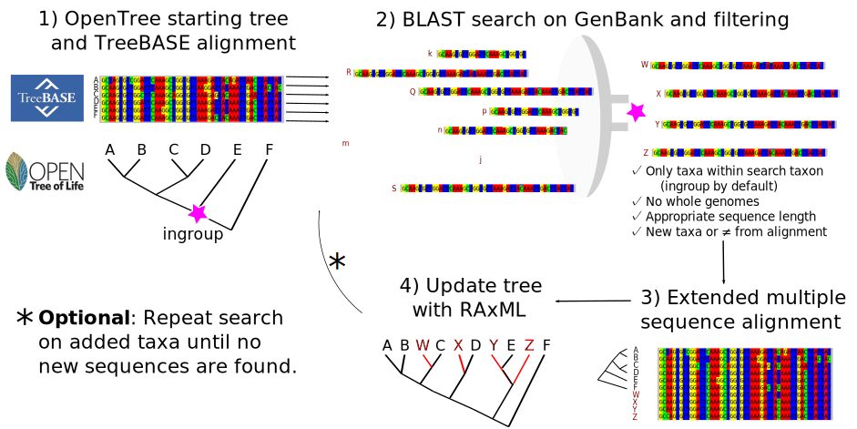

## The Physcraper framework

While genome scale data is increasing rapidly, there are still large quantities
of single locus nucleotide sequence data being uploaded to the US National Center on Biotechnology
Information (NCBI) database [GenBank](https://www.ncbi.nlm.nih.gov/genbank/statistics/).
These data are often appropriate for looking at phylogenetic relationships, and
have the advantage of being orthologous to genetic sequences that have been used to construct existing phylogenetic trees.

If you have access to a single gene or multilocus nucleotide alignment, and a phylogenetic tree, Physcraper automates
adding nucleotide sequences of new lineage samples into your tree by using [Open Tree of Life](#the-open-tree-of-life) tools to reconcile Taxonomy, and the [BLAST](https://blast.ncbi.nlm.nih.gov/Blast.cgi) algorithm to search for loci in the [GenBank](https://www.ncbi.nlm.nih.gov/genbank/statistics/) genetic database that are likely to be
locally similar to sequences in the initial DNA alignment.

By using a starting alignment and tree, Physcraper takes advantage of DNA loci alignments as  homology hypotheses (ideally orthology, see [FAQs](https://physcraper.readthedocs.io/en/stable/faq.html)) that
previous researchers have assessed, curated, and deemed appropriate for the phylogenetic scope.
The sequences added during a BLAST search are limited either to a user specified taxon or
monophyletic group, or within the taxonomic scope of the ingroup of the starting tree.

These automated, reproducible trees can provide a quick inference of potential phylogenetic relationships,
as well as flag problems in the taxonomic assignments of sequences, paralogy and orthology, and areas of potential systematic interest.

 

Figure 1 from [Sanchez-Reyes et al. 2021](https://doi.org/10.1186/s12859-021-04274-6):
The Physcraper framework consists of 4 general steps. The methodology is further described in the [Implementation](https://physcraper.readthedocs.io/en/latest/implementation.html) section of this documentation.

 
 

## The Open Tree of Life

The Open Tree of Life (OpenTree) is a project that unites expert, peer-reviewed [phylogenetic inferences](https://github.com/OpenTreeOfLife/phylesystem-1) and
[taxonomy](https://tree.opentreeoflife.org/about/taxonomy-version/ott3.3)
to generate a [synthetic tree](https://tree.opentreeoflife.org/opentree/argus/opentree13.4@ott93302) estimate of species relationships across all life.

 

OpenTree synthetic tree. Figure 1 from [Hinchliff et al. 2015](https://www.pnas.org/content/112/41/12764.short).
For more information on the OpenTree project go to https://opentreeoflife.github.io

 

OpenTree aims to construct a comprehensive, dynamic and digitally-available tree
of life by synthesizing published phylogenetic trees along with taxonomic data.
Currently the tree comprises 2.3 million tips.
However, only around 90,000 of those taxa are represented by phylogenetic estimates -
the rest are placed in the tree based on their taxonomic names.

To achieve this, the OpenTree Taxonomy (OTT) constructs a reference taxonomy for taxonomic reconciliation, through
an algorithmic combination of several source taxonomies, such as:
- [Hibbet et al. 2007](https://doi.org/10.1016/j.mycres.2007.03.004),
- [SILVA](http://www.arb-silva.de/),
- the [Index Fungorum](http://www.indexfungorum.org/),
- [Schäferhoff et al. 2010](https://doi.org/10.1186/1471-2148-10-352),
- the [World Register of Marine Species](WoRMS; http://www.marinespecies.org/aphia.php)
- the [NCBI Taxonomy](https://www.ncbi.nlm.nih.gov/books/NBK21100/),
- the Global Biodiversity Information facility [(GBIF) backbone Taxonomy](https://www.gbif.org/), and
- the [Interim Register of Marine and Nonmarine Genera (IRMNG)](https://irmng.org/).
